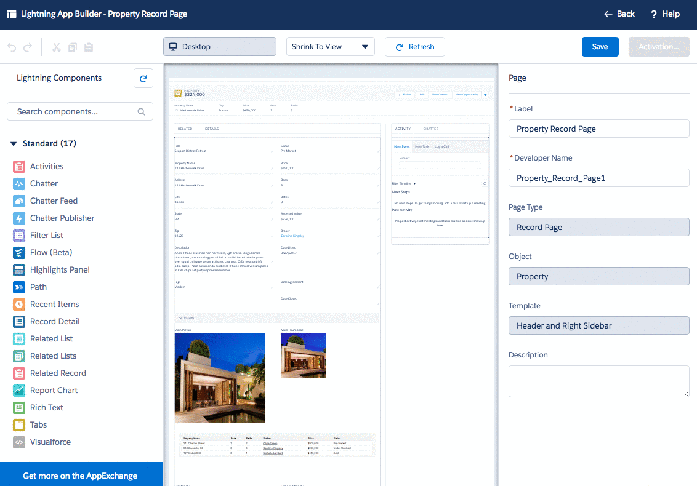

## Exercise 5: Create New Lightning Console App & Edit Record Page (45min)

You can take full advantage of Lightning features by creating a Lightning version of your app. You can create a Lightning app with standard navigation from Setup | App Manager | Upgrade App, but we want to create a new Lightning Console app so we will create a  new app from the App Manager. Lightning Console apps allow users to edit and reference multiple records at once. When a user chooses a record from a related list, it opens as a tab in the console. When a user opens a related record, it opens as a subtab. Console apps remember tabs, so that when a user navigates away from the page, they don’t lose any time when they come back. Console apps in Lightning Experience have much of the same console functionality as Salesforce Classic, such as the three-column layout and pinned tabs, but updated with the styling of Lightning Experience, Utility Bar, Tabs exclusive to Lightning such as Calendar & Notes, and Component powered pages and tabs.

### Build New Lightning Console App 

#### Create New App with App Manager

1. Setup | App Manager | New Lightning App 
    1. App Details & Branding 
        1. Name: Dreamhouse Console 
        2. Developer Name: Dreamhouse_Console
        3. Description: Console app for Lightning Dreamhouse Users
        4. Logo: Downloaded SVG file from prep-work 
        5. Primary Color Hex Value: #C41E1E
        6. Next
    2. App Options
        1. Console Navigation
        2.  Next

#### Utility Bar

The utility bar gives your users quick access to common productivity tools, like Notes and Recent Items. It appears as a fixed footer that users can access to open utilities in docked panels. Utilities harness the power of Lightning components. You can add a utility bar to any Lightning app, including standard and console apps. Previously, you could only add or customize a utility bar using the API. You select which Lightning components you want to add to a utility bar and specify their properties. You can specify how big the utility panel is and what label and icon you want to display in the utility bar. 

1. **Utility Bar**
    1. Add Utility Bar Item: Chatter Publisher
        1. Label: Post to Chatter
        2. Icon: feed
        3. Panel Width: 340
        4. Panel Height: 480
        5. Type: Global
    2. Add Utility Bar Item: Recent Items
        1. Label: Recent Items
        2. Icon: layers
        3. Panel Width: 340
        4. Panel Height: 340
        5. Objects: Broker, Dashboard, Group, Property
        6. Number of Records to Display: 5
    3. Add Utility Bar Item: Notes
    4. Next 

#### Finish Building Console App 

Now you can select the items to be included in the Console App. Tabs that are tied to Lightning features like Notes and Calendar are only available when you are creating or editing a Lightning App. So we are able to add additional elements to this app that we could not add earlier to our Classic App. 

1. Select Items: 
        1. Update Selected Items Column to include: 
            1. Home
            2. Chatter
            3. Groups
            4. Calendar
            5. Properties
            6. Brokers
            7. Notes
            8. Dashboards
            9. Reports
        2. Next
2. Assign to User Profiles:
    1. Update Selected Profiles Column to include: 
        1. Dreamhouse User
        2. System Administrator
    2. **Save & Finish** 

Let's explore the new Lightning Console App! Navigate to the new app in the App Launcher menu and play around with opening multiple tabs, opening records, and clicking into the Utility Bar. Try “pinning” tabs to your console, and experiment with opening the Utility Bar and then navigating around to different tabs. 

### Customize and Assign Property Record Page

Now that we've created our new Lightning Console app, lets take a look at it and customize the experience even more with the Property record page. With Lightning App Builder Admins can create a record page from scratch, or make a copy of an existing record page right. Give your users a customized view for each object’s records by adding, editing, or removing components to change the page’s layout, and you can customize your users’ experience even more granularly by creating custom record pages and assigning them by app, record type, and user profile. We are going to make changes to the Property page using Standard Lightning Components and assign this customized Property Record page to the Lightning Console app we just created. 

1. App Launcher | Dreamhouse Console | Properties Tab (may be a drop-down)
    1. Open a Property Record page
    2. Click through the tabs on this page, notice how the page is organized including the details page layout, the activity tab, and the related lists. 
    3. Setup | Edit Page to enter the Lightning App Builder page 
        1. Drag the Path Component onto the page below the Highlights Panel 
    4. Select Details Tab and in the right sidebar, select Add Tab
        1. For new tab label select Custom Tab and type “Analytics”
        2. Done
    5. Click into this new tab, Analytics. 
        1. Drag the Report Chart component into the Analytics tab area
        2. Select the “Property Listings” report
    6. Save
    7. Activate
    8. App Default | Assign as App Default | Dreamhouse Console | Save
    9. Click **Back** to revisit the record you were viewing. Notice the page layout has been modified to include Path & the Analytics Tab.
    10. To test the page assignment, use App Launcher | Dreamhouse Classic to return to your Classic app. Click into a property record, notice Path is not available on this page. 

**Great Job!** With only using clicks you went through the major phases of bringing a Classic app to Lightning Experience. You enabled an existing app and user for Lightning, created a new Lightning app complete with features like Utility Bar, and assigned a customized record page experience to a specific Lightning app.  

#####On to **[Exercise 1](Exercise_1.md)** of the programmatic exercises
